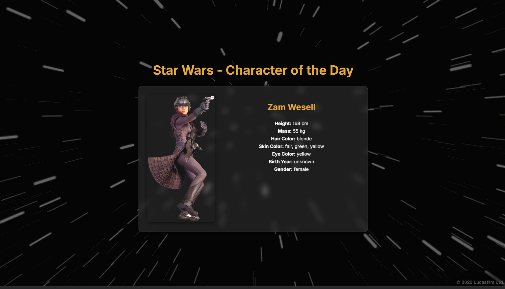

## Name
Star Wars Character of the Day

## Beschreibung
Eine Website, die für jeden User einen Star Wars Charakter anzeigt abhängig vom Tag.  
Im Hintergrund wird die SWAPI genutzt für die Fakten zu dem Charakter.  
Die Website basiert auf next.js.  

## Bild


## Installation
- Es wird Node.js benötigt. Installationsdatei können über die offizielle Webseite https://nodejs.org/en  bezogen werden. 
- Bei Bedarf den Rechner neustarten  
- Im Terminal Befehl ausführen: 
  ```bash
  npm install next@latest react@latest react-dom@latest
  ```  
- Downloaden beziehungsweise clonen des Repositories "Case-Study-Frontend"  
- Im Terminal zum Ordner " star-wars-character " wechseln  
- Den Befehl `npm run dev`  ausführen  
- Die Webseite ist erreichbar nach der Nachricht "Ready in (Zeitangabe)"  
- Im Webbrowser die Adresse `http://localhost:3000/` aufrufen  

## Einbinden von Single Sign-On - Theorie
Um Single Sign-On (SSO) in der Anwendung zu implementieren können OAuth2 oder SAML verwendet werden. SAML ist stabil und standardisiert, jedoch auch etwas schwerfälliger und komplexer als OAuth2, daher wird an dieser Stelle nur die Herangehensweise mit OAuth2 beleuchtet. 

Für die Implementierung von OAuth2 müssen die folgenden Schritte ausgeführt werden: 
- Wählen eines Identity Providers (IdP), dieser stellt ein Access Token bereit mit welchem die Anwendung Benutzer identifizieren kann. Es kann bspw. Google (Google Oauth2), Azure Active Directory, GitHub OAuth o.ä. verwendet werden. 
- Für die Integration von OAuth2 in die Anwendung wird die Bibliothek NextAuth.js benötigt. Diese kann wie folgt installiert werden: 
  ```bash
  npm install next-auth
  ```
- Für die Authentifizierungskonfiguration wird die Datei `.ts`-Datei benötigt. Beispielcode zu dieser ist in der Datei `nextauth.js` unter `src/star-wars-character/src/app/nextauth.js` zu finden. 
-  In der Konfigurationsdatei wird auf Client-IDs und Secrets der Provider verwiesen. Diese müssen über eine .env-Datei im Projekt bereitgestellt werden.
- Anschließend an die Integration des/der gewünschten OAuth-Providers muss die Startseite entsprechend um eine Schaltfläche bzw. Loginseite für die Mitarbeiter erweitert werden. Dafür können die folgenden Pakete verwendet werden:
  ```bash
  "use client"; // Indicates that this module is client-side code.
  import { signIn, signOut, useSession } from "next-auth/client";
  ```
  Die Direktive "use client" weist die Anwendung an, die Anmeldung clientseitig zu verarbeiten und das Formular ausschließlich im Browser darzustellen und stellt damit den vollen Zugriff auf alle Browser-APIs sicher. Eine serverseitige Verarbeitung ist auch möglich, wird hier aber nicht weiter erläutert. 
  Die Pakete können dann wie folgt bspw. zum Einloggen über einen Button verwendet werden: 
  ```bash
  OnClick={() => signIn("Provider", { callbackUrl })}
  ```
  Der callbackUrl-Parameter wird standardmäßig von NextAuth erstellt und kann genutzt werden, damit der Benutzer nach der Anmeldung wieder korrekt an die vorherige Seite weitergeleitet wird. Um dies sicherzustellen ist das Prüfen auf das Vorhandensein des Parameters ratsam. 

## Support
Bei technischen Schwierigkeiten (EMAIL) kontaktieren.  

## Roadmap
- Umsetzen des Single Sign-On  
- Weitere Anpassung der Webseite nach Absprechung mit den Stakeholder  
- Absprache bezüglich Copyright der Bilder (Deswegen auch keine Bilder für alle 83 Charactere)  
- Wenn möglich, Bilder von allen Charakteren einbinden  
- Light- und Dark Mode  
- Einbinden der Heimatplanete, verschachtelte API-Abfrage  
- Optimierung der AAA-Vorschrift für den Barrierefreien Zugriff, WCAG-Konformitätsstufen  

## Mitwirkende 
-private 
